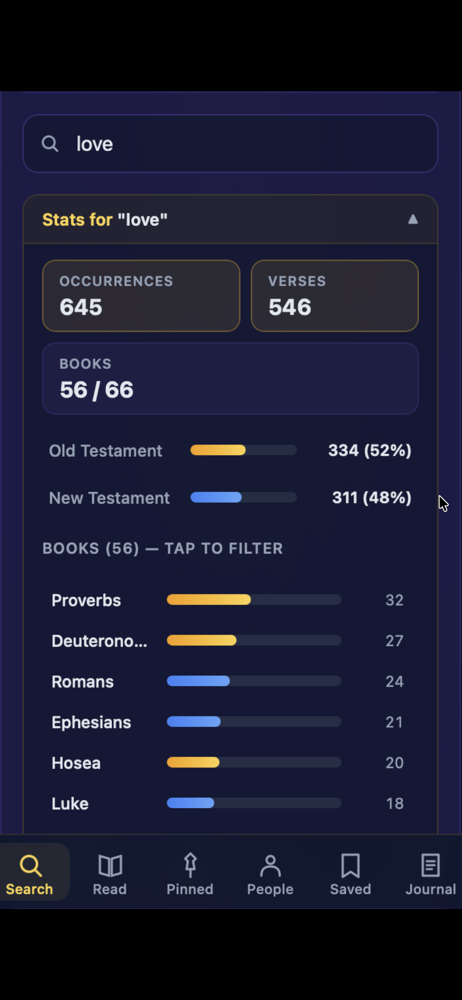
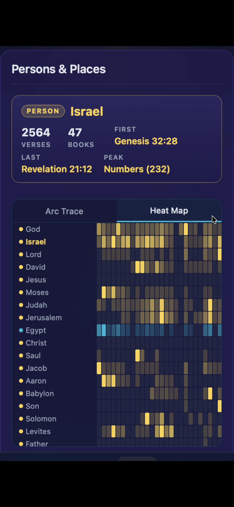
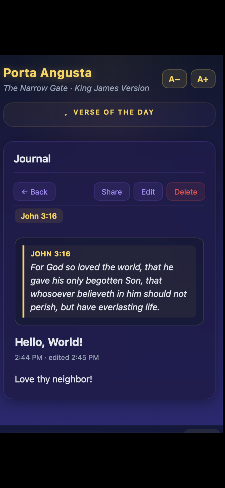
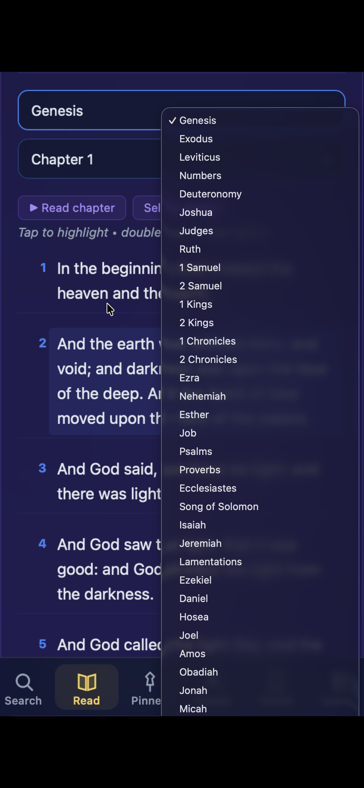
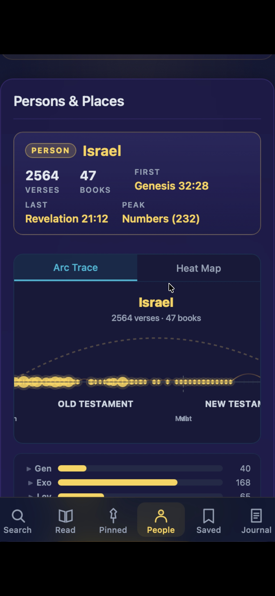
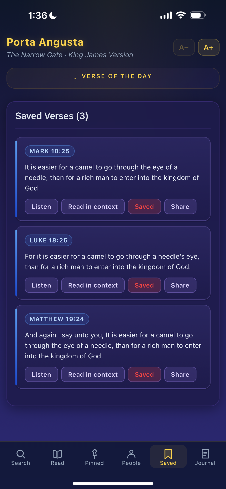
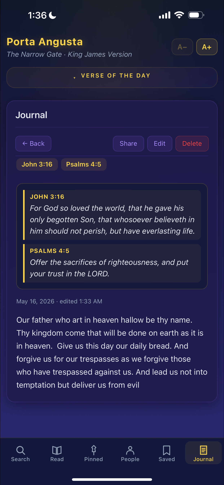

<p align="center">
  
</p>

<h1 align="center">Porta Angusta — The Narrow Gate</h1>

<p align="center"><em>A King James Bible reader for iOS. Fully offline.</em></p>

<p align="center">
  <a href="https://apps.apple.com/app/id6770117302"></a>
  <a href="LICENSE"></a>
  <a href="https://github.com/ArcSelf/porta-angusta/actions/workflows/web-ci.yml"></a>
  <a href="https://github.com/ArcSelf/porta-angusta/commits/main"></a>
  <a href="https://github.com/ArcSelf/porta-angusta/stargazers"></a>
</p>

<p align="center">
  <a href="https://apps.apple.com/app/id6770117302">App Store</a>
  &nbsp;·&nbsp;
  <a href="https://arcself.github.io/porta-angusta/">Site</a>
  &nbsp;·&nbsp;
  <a href="https://arcself.github.io/porta-angusta/privacy.html">Privacy</a>
</p>

> "Enter ye in at the strait gate… because strait is the gate, and narrow is
> the way, which leadeth unto life, and few there be that find it."
> — Matthew 7:13–14

A King James Bible reader for people who want to read the Word carefully —
and want their tools to keep up. No accounts, no telemetry, no network
calls of any kind.

<p align="center">
  
  
  
</p>

<p align="center">
  <sub><em>Search statistics with OT/NT split · Named-entity heat map · Journal with verse text rendered</em></sub>
</p>

<details>
<summary><strong>More screenshots</strong></summary>

<p align="center">
  
  
  
</p>

<p align="center">
  
</p>

<p align="center">
  <sub><em>Read with book picker · Arc-trace canonical journey · Saved verses · Journal with multi-verse linking</em></sub>
</p>

</details>

---

## What's inside

- **Read.** Book and chapter navigation. Adjustable text size, dark theme.
  Tap a verse to highlight, double-tap to hear it.
- **Search.** Type any word or reference. A live statistics panel breaks every
  search into Old Testament vs. New Testament, then drills into per-book and
  per-chapter counts. Tap any of them to filter. Pin searches you return to.
- **People & Places.** Hundreds of named persons and places, automatically
  discovered from the KJV text. Each one gets a summary card plus an arc
  diagram tracing where they appear across the canon.
- **Journal.** Voice or type your reflections. Attach one verse or many. Tap
  "Reflect" on any verse anywhere in the app to start or append a note.
- **Listen.** The whole chapter, or just the verses you've selected, read
  aloud by the system voice.

The complete KJV — 66 books, 31,102 verses — ships inside the binary as a
CSV. No login, no network, no tracking. Open the app once and it works on
a plane, in a tent, in a cell.

---

## Architecture

A native Swift WKWebView host wrapping a self-contained React + TypeScript +
Vite reader. The two halves talk through a custom `bibleapp://` URL scheme,
which lets `localStorage` work as a proper origin and bundles the whole web
app inside the iOS binary.

```
ios/                          # Swift app target (WKWebView shell)
  KJVBible/
    KJVBibleApp.swift           # SwiftUI entry point
    BibleWebView.swift          # UIViewRepresentable WKWebView
    BundleSchemeHandler.swift   # bibleapp:// URL scheme handler
    Info.plist                  # Display name, privacy strings, ProMotion
    PrivacyInfo.xcprivacy       # Required API declarations
    Assets.xcassets/            # App icon + accent color
    WebApp/                     # Built web bundle (output of `npm run build`)
  KJVBible.xcodeproj

web/                          # React reader (source)
  src/
    pages/BibleApp.tsx          # Main tabbed reader
    components/bible/           # Search, Read, Journal, Entities, etc.
    hooks/                      # useBibleData, useTextToSpeech, useJournal
    utils/share.ts              # navigator.share wrapper
  public/kjv.csv                # 31,102 verses
  package.json, vite.config.ts

scripts/                      # Build & screenshot helpers
  rebuild-web.sh                # npm run build && restage WebApp/
  resize_screenshots.py         # Normalize iPhone screenshots to App Store sizes

index.html, privacy.html      # GitHub Pages site (served at arcself.github.io/porta-angusta)
```

---

## Build & run

You need **Xcode 26+** and **Node 18+** on macOS.

```bash
# 1. Build the web bundle and stage it inside the iOS target
cd web
npm install
npm run build
cp -R dist/. ../ios/KJVBible/WebApp/

# 2. Open and build the iOS app
cd ../ios
open KJVBible.xcodeproj
# In Xcode, select an iPhone simulator (iPhone 16/17 etc.) and ⌘R.
```

A copy of the built `WebApp/` is checked in so you can skip step 1 if you
just want to run the iOS app immediately. Rebuild it whenever you change
anything under `web/src/`.

---

## Privacy

Porta Angusta makes **zero network requests** at runtime. The entire KJV
text, every UI image, and every line of JavaScript ships inside the binary.

- No analytics, no telemetry, no advertising identifiers.
- No third-party SDKs of any kind.
- `localStorage` keeps your bookmarks, pinned searches, journal entries,
  font scale, and daily-verse preference on the device only.
- The optional microphone permission feeds audio to Apple's on-device
  speech-recognition framework. Audio never leaves the device. We retain
  no transcripts.

Full policy: https://arcself.github.io/porta-angusta/privacy.html

---

## License

MIT. See [LICENSE](LICENSE).

The KJV text is in the public domain in the United States. In the United
Kingdom it remains under perpetual Crown copyright administered by Cambridge
University Press; non-commercial personal use is generally permitted.

---

> Thy word is a lamp unto my feet, and a light unto my path.
> — Psalm 119:105
